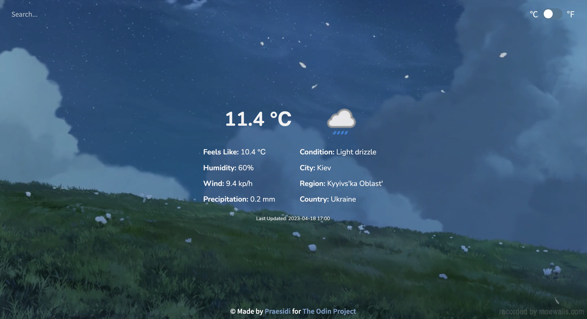

# weather-app

<h3 align="center"><a href="https://praesidi.github.io/weather-app/">DEMO</a></h2>

## About the project

A simple Weather App I made as a part of The Odin Project curriculum. The main goal was to practice with APIs and async/await functions.

## Features

- Search bar to search a location
- Switch toggle to change the weather format
- Auto search if the user has allowed to track his location

## Resources

- Background: [moewalls.com](https://moewalls.com)
- Favicon: [flaticon.com](https://flaticon.com)

## Built with

- HTML
- Sass
- JS
- Webpack
